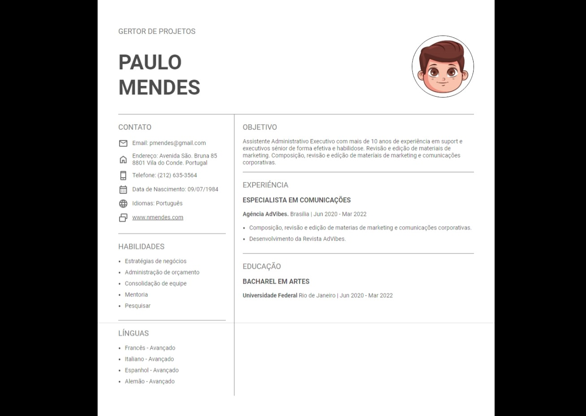

# Página de Currículo

Este é um projeto de uma página de currículo pessoal, criado com HTML e CSS. O objetivo é apresentar as informações profissionais, habilidades e experiência de forma clara e acessível.

## Tecnologias

- **HTML**: Estruturação do conteúdo da página.
- **CSS**: Estilização e design da página.

## Como Usar

1. Clone o repositório para o seu computador:

   ```bash
   git clone https://github.com/Rodrigo-Souza-DEV/1.-P-gina-Est-tica-de-Curr-culo
----------------------------------------------------------------------------------------------------------------------------------------------------

